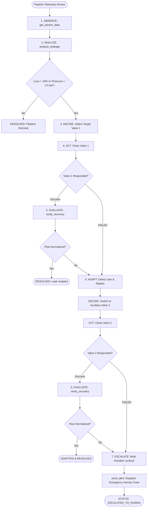

# AquaAgent: System Architecture & Agentic Workflow

## 1. Executive Summary

AquaAgent is an autonomous, goal-driven AI agent designed to mitigate municipal, industrial, and campus water infrastructure leakage. Unlike legacy monitoring setups (which only detect anomalies and passively page humans), AquaAgent implements an autonomous closed-loop control system:

$$\text{OBSERVE} \longrightarrow \text{ANALYZE} \longrightarrow \text{DECIDE} \longrightarrow \text{ACT} \longrightarrow \text{EVALUATE} \longrightarrow \text{ADAPT}$$

When pipeline actuators experience mechanical jams or network dropouts, AquaAgent does not crash or stall—it actively verifies post-action telemetry, diagnoses the failure, replans an alternative isolation path, executes auxiliary actuators, and verifies stabilization.

---

## 2. High-Level Architecture

```
                      +------------------------------------------+
                      |         Water Pipeline Network           |
                      |   (Main Line, Zone-A, Zone-B Sections)   |
                      +------------------------------------------+
                                    |               |
               Inflow / Outflow Flow Rate       Pipeline Pressure
                     (YF-S201 Sensors)          (0-1.2 MPa Transducer)
                                    |               |
                                    v               v
                      +------------------------------------------+
                      |         ESP32 / IoT Gateway Node         |
                      |  - 2-Second Periodic Interrupt Sampling  |
                      |  - Calibrated Signal Normalization       |
                      |  - JSON Serialization via HTTP POST      |
                      +------------------------------------------+
                                           |
                                           v
+=====================================================================================+
|                             AquaAgent FastAPI Backend                               |
|                                                                                     |
|   [Telemetry Ingestion / Simulation Engine]                                         |
|       |                                                                             |
|       v                                                                             |
|   [AquaAgent Autonomous Controller] <========================> [Agent State Memory] |
|       |                                                        - Goal & Active Phase|
|       | 1. OBSERVE (Telemetry Tool)                            - Decision & Rationale
|       | 2. ANALYZE (Leakage Analysis Engine)                   - Attempted/Failed Valves
|       | 3. DECIDE  (Deterministic Policy / LLM Explainer)      - Event Log History  |
|       | 4. ACT     (Actuator Valve Tool)                                            |
|       | 5. EVALUATE(Post-Action Verification Tool)                                  |
|       | 6. ADAPT   (Dynamic Re-Planner on Failure)                                  |
|       |                                                                             |
|       +----------> [Controlled Tools Ecosystem]                                     |
|                        |-- get_sensor_data()                                        |
|                        |-- analyze_leakage(sensor_data)                             |
|                        |-- control_valve(valve_id, action)                          |
|                        |-- verify_recovery()                                        |
|                        |-- send_alert(message, severity)                            |
|                        +-- get_zone_status(zone)                                    |
|                                                                                     |
+=====================================================================================+
                                           |
                                           v  (REST / WebSocket Polling)
                      +------------------------------------------+
                      |     Interactive Web Dashboard (React)    |
                      |  - Real-Time Sensor Telemetry Cards      |
                      |  - Live Agent Phase & Decision Tracker   |
                      |  - Time-Series Telemetry Flow Chart      |
                      |  - Event Activity Log & Step Visualizer  |
                      |  - Scenario Trigger & Failure Demo Panel |
                      +------------------------------------------+
```

---

## 3. The Core Agentic Loop



---

## 4. Failure Handling & Closed-Loop Verification

AquaAgent implements robust industrial fail-safes:
1. **Hardware / Actuator Verification**: Unlike simple systems that assume a relay switched, AquaAgent verifies downstream pressure drop and flow balance.
2. **Dynamic Alternative Routing**: Primary sector isolation ($\text{Valve 1}$) falls back automatically to the auxiliary sector bypass ($\text{Valve 2}$).
3. **Emergency Escalation Gate**: If multiple mechanical failures prevent automatic containment, the agent escalates to on-call maintenance teams with full diagnostic context.
